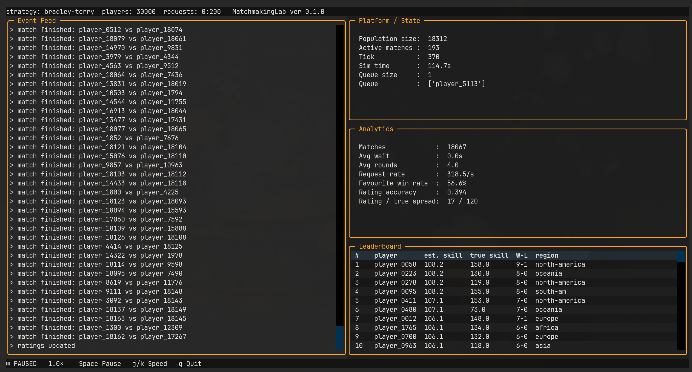

<h1 align="center">Matchmaking Lab</h1>

<p align="center"><a href="https://github.com/anspiteri/MatchmakingLab/tags"></a></p>

<p align="center">A platform for prototyping, analysing &amp; exploring different matchmaking approaches for competitive online games.</p>

<p align="center"></p>

<br>

## Status

This is an early alpha prototype with a runnable matchmaking loop. It generates players, queues and matches them, simulates results, updates estimated skill, and shows live measurements. The Bradley-Terry approach is currently implemented; the interface and project structure may change.

<br>

## Background
Matchmaking services are a core component of match-based competitive video games (League of Legends, Call of Duty, Fortnite, to name a few). At a basic level, these services seek to match queuing players based on features such as skill level, geographical region, latency / ping to servers, and queue time with the goal of optimising engagement and match satisfaction. There is an interesting history of approaches and developments to this kind of optimisation problem. To access some of the research that went into this project, see [references](./references/bibliography.md).

I decided to build this project to grow my applied algorithmic skills in the context of application design. This domain requires both in-depth algorithmic thinking and general engineering and architecting skills. This is also an interesting domain for me because of my personal experience playing Fortnite, Halo and other competitive games.

<br>

## Project Constraints
To focus my time on my desired growth areas I've decided to use the following constraints:
- Mocking of player / client requests using a "generator" scripted in python
- No auth or account management (all requests are treated as valid)
- Simulated / random match results instead of real matches
- Interactive TUI via [Click](https://click.palletsprojects.com/) and [Textual](https://github.com/Textualize/textual) instead of a production deployment

<br>

## Project Structure
```
MatchmakingLab/
├── docs/                     design decisions and working diary
├── references/
|   ├── papers/               research papers referenced by the project
|   └── bibliography.md
├── src/matchmakinglab/
|   ├── core/                 shared data models, runtime state and sim snapshots
|   ├── matchmakers/          matchmaking approaches (strategy pattern)
|   |   ├── bradley_terry/    the Bradley-Terry implementation
|   |   ├── base_strategy.py  abstract MatchmakingStrategy
|   |   ├── base_generator.py abstract RequestGenerator
|   |   └── factory.py        wires a strategy to its generator
|   ├── platform/             platform orchestration, match simulation and the SimHarness
|   ├── ui/                   Textual TUI (app, event feed, stat panels, leaderboard)
|   └── cli.py                CLI entrypoint
├── tests/                    unit + integration (headless Textual) tests
└── pyproject.toml            package metadata, dependencies and CLI script
```

<br>

## Architecture
Matchmaking approaches plug into a shared simulation platform through a strategy and its request generator. The simulation harness coordinates player requests, matching, and simulated outcomes, then produces snapshots for the display layer.

The CLI configures a run and presents it through either a [Textual](https://github.com/Textualize/textual) interface or headless output. Both use the same simulation; the display reads snapshots rather than changing simulation state.

For more details on each module, see [architecture](./docs/architecture.md).

<br>

## Releases
Download packaged versions from the [GitHub Releases](https://github.com/anspiteri/MatchmakingLab/releases) page. For normal use, download the `.whl` file, install it in a Python environment, then run the CLI:

```bash
python -m pip install ./matchmakinglab-0.1.0a0-py3-none-any.whl
matchmakinglab
```

The packaged `.tar.gz` can also be installed with `pip`. Each release additionally includes GitHub-generated **Source code (zip)** and **Source code (tar.gz)** snapshots containing the repository exactly as it was at the release tag. Extract either snapshot if you want to inspect that version or install it from source with `python -m pip install .`.

<br>

## Development
### Setting up & using a python environment
For first time use, set up a python environment using:
`python3 -m venv .venv`

Afterwards, use the following to activate the environment when working on the project:
`source .venv/bin/activate`

### Building & running
For building the project into a runnable program use:
`pip install -e ".[dev]"`

The entrypoint is the `matchmakinglab` command (registered as the `matchmakinglab.cli:cli` console script):

- **Interactive guided setup** — omitted options walk you through strategy selection and configuration:
  `matchmakinglab`

- **Boot a specific strategy with its sub-configuration** (positions after the strategy name, in order):
  `matchmakinglab --strategy bradley-terry naive greedy`

- **Boot with defaults, skipping all prompts**:
  `matchmakinglab --default`

- **Headless mode** — run the simulation without the TUI, logging per-tick stats to stdout:
  `matchmakinglab --default --headless --ticks 500`

- **Export** — write the same per-tick data to a file. The format comes from the extension, `.csv` or `.jsonl`:
  `matchmakinglab --default --headless --ticks 500 --export run.csv`

- **Seed** — pass a seed through to the harness for reproducible runs:
  `matchmakinglab --default --seed 42`

- **Population size** — how many simulated players the run can ever contain (default 500):
  `matchmakinglab --default --players 150`

- **Requests per tick** — how much work arrives each tick, as an inclusive `MIN:MAX`
  range (default `10:50`). A fixed rate is the degenerate case:
  `matchmakinglab --default --requests 10:10`

  `MIN` may be `0`, which lets some ticks arrive nobody:
  `matchmakinglab --default --requests 0:50` gives a world with lulls in it,
  rather than the metronome a range starting high produces.

  Both of these are also asked for in the interactive guided setup, where a flag
  you passed skips its own question. Note that the widest batch must fit in the
  population, so `--players 8 --requests 1:50` is refused at startup rather than
  failing on the first tick.

To see the full help, including each strategy's sub-configuration order, use:
`matchmakinglab --help`

<br>

## License
This project is licensed under the [GNU General Public License v3.0](./LICENSE).

Chosen for its copyleft terms: derived or modified versions must be made available under the same license, keeping the project and its downstream forks open. This is in keeping with the goal of sharing matchmaking research and implementations as an open platform.
